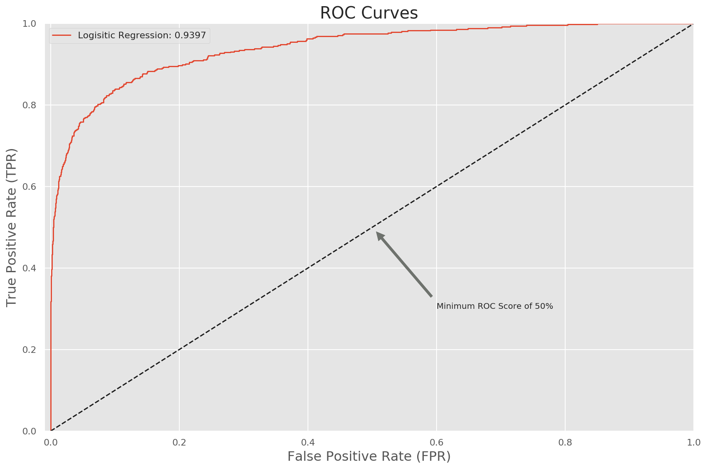
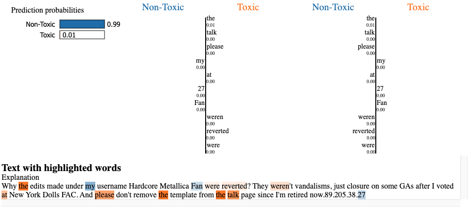
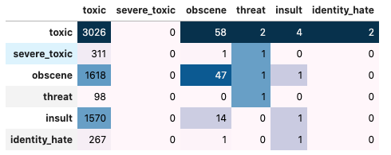
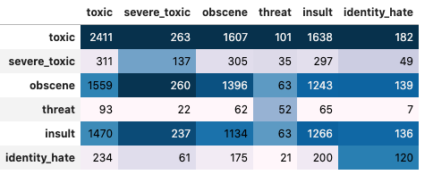
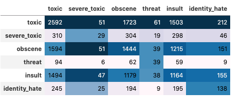

Table of Contents
=================
   * [Business Problem](#business-problem)
   * [Text Data Processing](#text-data-processing)
   * [Visualization](#visualization)
   * [Modelling (Binary Classification toxic or not)](#modelling-binary-classification-toxic-or-not)
   * [Model Evaluation for Binary Classification](#model-evaluation-for-binary-classification)
   * [Model Explanation using lime for Binary Classification](#model-explanation-using-lime-for-binary-classification)
   * [Deep Learning Modelling (Multilabel Classification): Keras   Fasttext](#deep-learning-modelling-multilabel-classification-keras--fasttext)
   * [Deep Learning Modelling (Multilabel Classification): BERT](#deep-learning-modelling-multilabel-classification-bert)
   * [Deep Learning Modelling (Multilabel Classification): XLNET](#deep-learning-modelling-multilabel-classification-xlnet)
   * [Compare f1-scores for deep learning methods](#compare-f1-scores-for-deep-learning-methods)

# Business Problem
We are given large number of Wikipedia comments which have been labeled by human raters for toxic behavior.
The types of toxicity are: `toxic`, `severe_toxic`, `obscene`, `threat`, `insult`, `identity_hate`.
We should create a model which predicts a probability of each type of toxicity for each comment.

# Text Data Processing
For the text data series we can create some features based on the given text. Some feature engineerings are:
```python
Number: letters, capitals, punctuations, symbols, words, sentences, unique words, smileys, qn marks, excl marks
Mean: capitals, word length
Ratio: num of words / num of unique
```

Basic steps of text processing:
```
Remove: digits, punctuations
Conversion: lowercase
Split: split sentences into words
Stopwords: remove stopwords
Lemmatize: convert word to its base form
```

# Visualization
After doing the preprocessing of the data, we can get more insights into data using some visualization.


# Modelling (Binary Classification toxic or not)
For the text classification I used Logistic Regression with following pipelines:
```
preprocess the data and add features
lemmatization
tf-idf for words
tf-idf for characters
then, logistic regression with grid search parameters
```
After searching for hyper parameters I got following results:
```
Accuracy :  0.9516096780643871
Precision:  0.9154411764705882
Recall   :  0.532051282051282
F1-score :  0.672972972972973
```

# Model Evaluation for Binary Classification
The ROC AUC curve is given below


# Model Explanation using lime for Binary Classification
For the model explanation we can use lime module. For example for one sample here the model predicts the comment to
be non-toxic. Why the model thinks this particular row is classified as non-toxic? We can look the image below:


# Deep Learning Modelling (Multiclass Classification): Keras + Fasttext
Horizontal quantities are true labels and vertical quantities are predicted labels. For example first row second quantitiy is true `toxic` but predicted as `severe_toxic`.

```
              precision    recall  f1-score   support

           0       0.11      0.98      0.19      3092
           1       0.00      0.00      0.00       313
           2       0.02      0.03      0.02      1667
           3       0.12      0.01      0.02        99
           4       0.00      0.00      0.00      1585
           5       0.00      0.00      0.00       269

   micro avg       0.10      0.44      0.16      7025
   macro avg       0.04      0.17      0.04      7025
weighted avg       0.05      0.44      0.09      7025
 samples avg       0.10      0.06      0.07      7025
```

# Deep Learning Modelling (Multilabel Classification): BERT

```
Best Threshold     : 0.41000000000000003
Test F1 Accuracy   : 0.7806
Test Flat Accuracy : 0.9234
               precision    recall  f1-score   support

        toxic       0.84      0.80      0.82      3092
 severe_toxic       0.48      0.56      0.52       313
      obscene       0.80      0.86      0.83      1667
       threat       0.50      0.56      0.52        99
       insult       0.71      0.83      0.77      1585
identity_hate       0.60      0.46      0.52       269

    micro avg       0.77      0.79      0.78      7025
    macro avg       0.66      0.68      0.66      7025
 weighted avg       0.77      0.79      0.78      7025
  samples avg       0.07      0.07      0.07      7025
```

# Deep Learning Modelling (Multilabel Classification): XLNET

```
I have used 3 epochs for both bert and xlnet. However bert gives better f1-score despite xlnet takes 3 hours to run and bert takes 1 hour in google colab gpu instance.

Best Threshold     : 0.51
Test F1 Accuracy   : 0.7670
Test Flat Accuracy : 0.9185
               precision    recall  f1-score   support

        toxic       0.78      0.84      0.81      3092
 severe_toxic       0.61      0.08      0.14       313
      obscene       0.77      0.86      0.82      1667
       threat       0.64      0.39      0.49        99
       insult       0.76      0.73      0.74      1585
identity_hate       0.64      0.51      0.56       269

    micro avg       0.77      0.77      0.77      7025
    macro avg       0.70      0.57      0.59      7025
 weighted avg       0.76      0.77      0.75      7025
  samples avg       0.07      0.07      0.07      7025
```

# Compare f1-scores for deep learning methods

| Quantity | Fasttext | BERT | XLNET |
| :---|:---|:---|:---|
| toxic | 0.19 | 0.82 | 0.81 |
| severe_toxic | 0.00 | 0.52 | 0.14 |
| obscene | 0.02 | 0.83 | 0.82 |
| threat | 0.02 | 0.52 | 0.49 |
| insult | 0.00 | 0.77 | 0.74 |
| identity_hate | 0.00 | 0.52 | 0.56 |
| micro_avg | 0.16 | 0.78 | 0.77 |
| macro_avg | 0.04 | 0.66 | 0.59 |
| weighted_avg | 0.09 | 0.78 | 0.75 |
| samples_avg | 0.07 | 0.07 | 0.07 |
