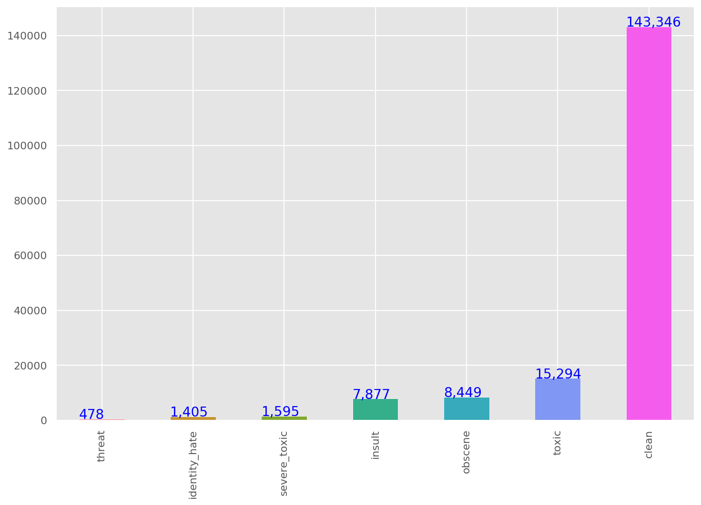
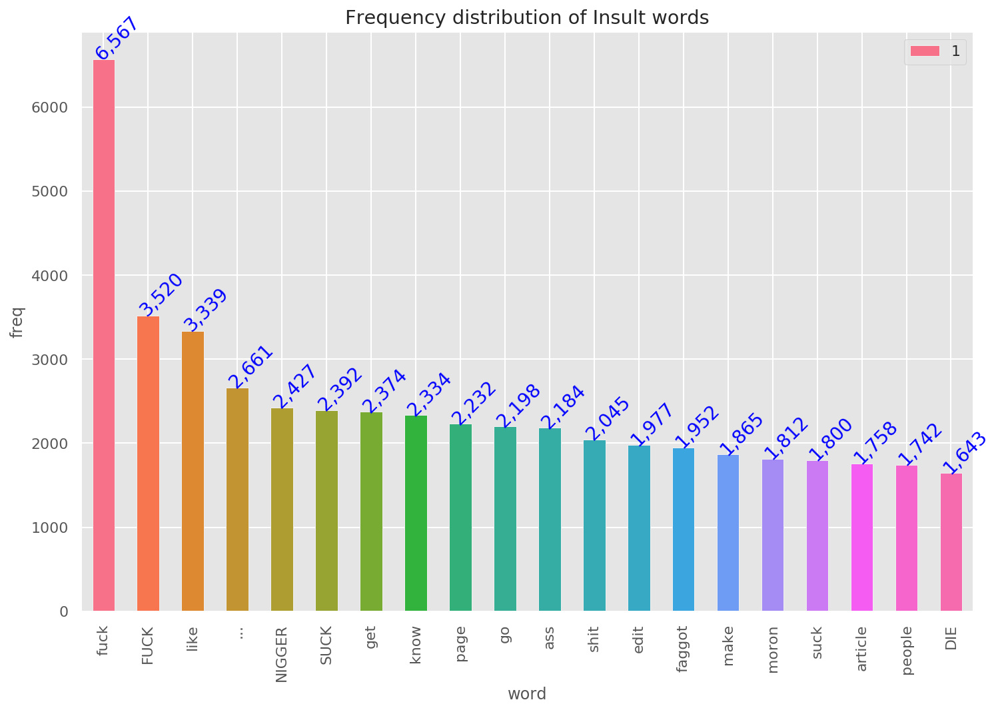
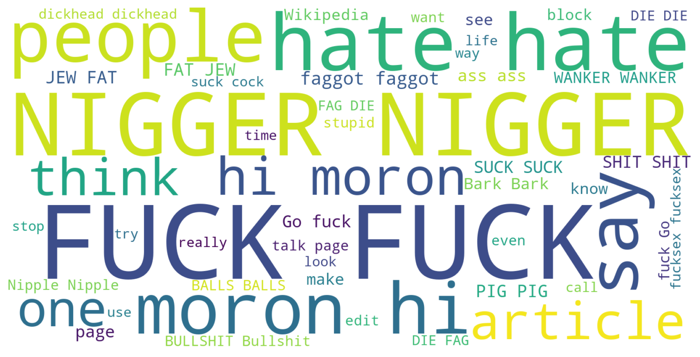
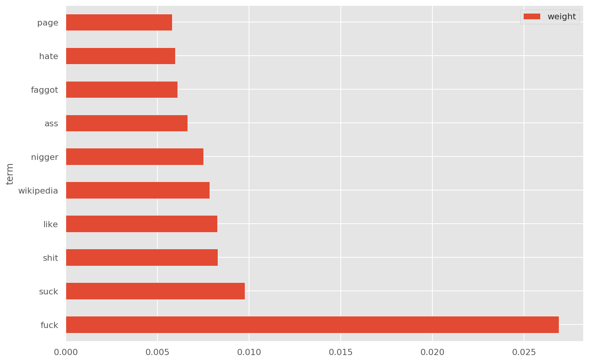

# Business Problem
We are given large number of Wikipedia comments which have been labeled by human raters for toxic behavior.
The types of toxicity are: `toxic`, `severe_toxic`, `obscene`, `threat`, `insult`, `identity_hate`.
We should create a model which predicts a probability of each type of toxicity for each comment.

# Text Data Processing
For the text data series we can create some features based on the given text. Some feature engineerings are:
```python
Number: letters, capitals, punctuations, symbols, words, sentences, unique words, smileys, qn marks, excl marks
Mean: capitals, word legth
Ratio: num of words / num of unique
```

Basic steps of text processing:
```
Remove: digits, punctuations
Conversion: lowercase
Split: split sentences into words
Stopwords: remove stopwords
Lemmatize: convert word to its base form

```

# Visualization
After doing the preprocessing of the data, we can get more insights into data using some visualization.





